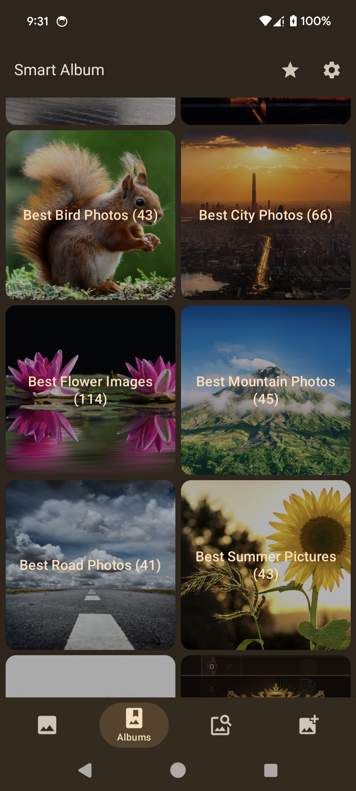
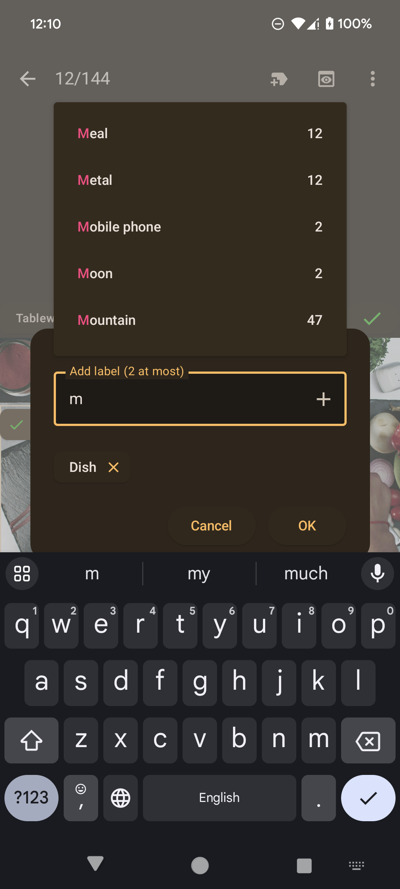
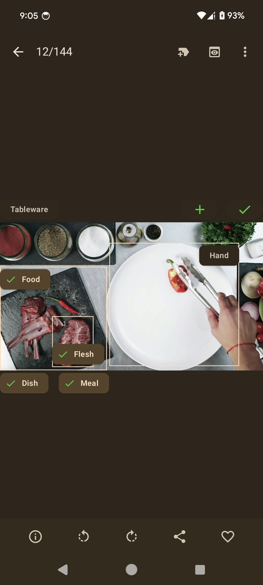
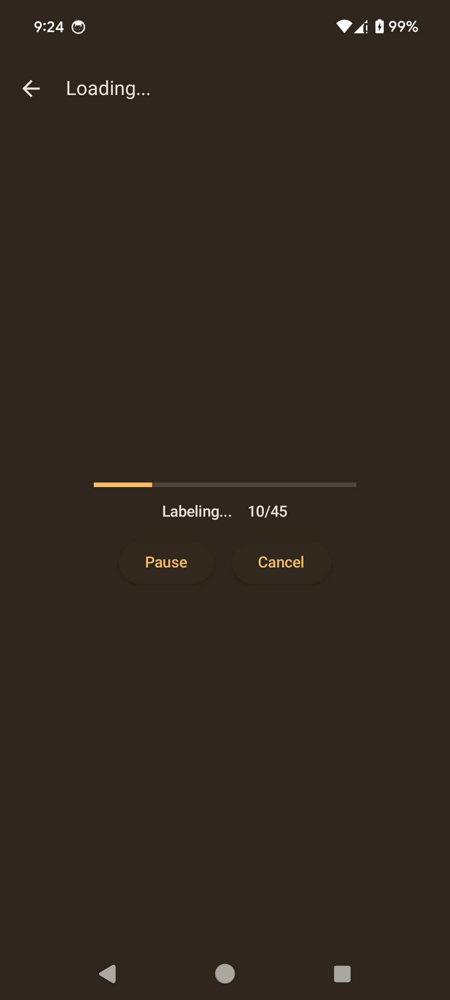

# Introduction
An photo album app written in Jetpack Compose, capable of managing photos, 
labeling images by ML Kit (machine learning) and searching images based on labeling results.

# Progress
Ready to publish to Google Play

# Techniques used in this App
Jetpack Compose, Coroutine & Flow, ML Kit, Android Room, Paging 3, Coil, DataStore, WorkManager, Hilt, etc.

# Features

## Album

  
&nbsp; &nbsp;
  
&nbsp; &nbsp;
  

&nbsp; &nbsp;
  
&nbsp; &nbsp;

## Object Detection / Image Labeling for Single Image

  
&nbsp; &nbsp;
  
&nbsp; &nbsp;
  

## Label Selection & Add Custom Labels

  
&nbsp; &nbsp;  
  
&nbsp; &nbsp;  
  

## Permission Handling

  
&nbsp; &nbsp;
  

## Object Detection / Image Labeling for multiple Images

  
&nbsp; &nbsp;
  
&nbsp; &nbsp;
  

## Image Search Based on Labeling Results

  
&nbsp; &nbsp;
  

## Setting

  
&nbsp; &nbsp;
  
&nbsp; &nbsp;
  

  
&nbsp; &nbsp;
  
&nbsp; &nbsp;
  

